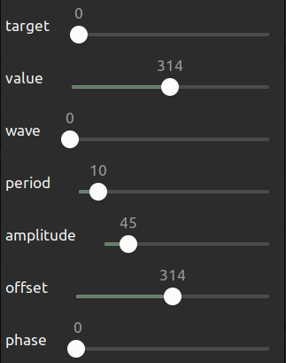

# 使用指南

1. target

目标对象,只有0/1
0输出yaw，1输出pitch

2. value

值，只在wave=0时起效，控制输出值

3. wave

波形
0 -> 无波形
1 -> 方波
2 -> 锯齿波
3 -> 正弦波
4 -> 三角波
5 -> 随机波
6 -> 叠加正弦波

4. period

周期，单位100ms

5. ampitude

振幅，单位0.01弧度

6. offset

偏置，单位0.01弧度，从0-628实际是-3.14到3.14

7. phase

相位